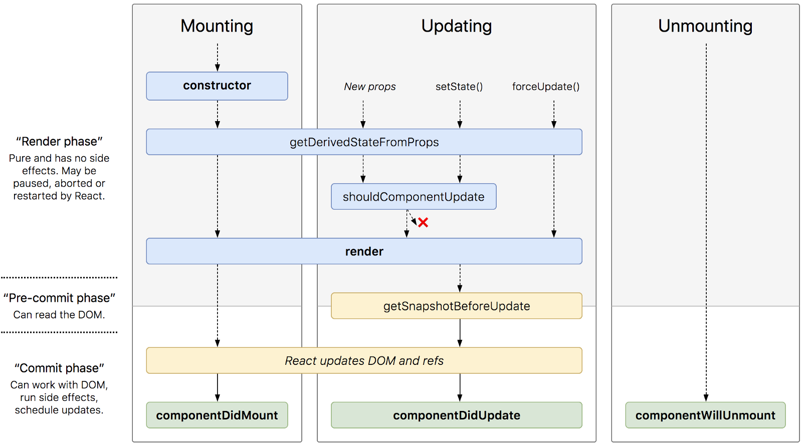

[返回目录](../README.md)
##### React 相关面试问题

1. ##### 说一下Vue和React的认识，做一个简单的对比。

1. ##### React的Dom的diff算法描述一下

1. ##### state 与 props 的区别

1. ##### React 的组件分类
    无状态组件 | 有状态组件；容器型组件 | 展示型组件
1. ##### setState

1. ##### React的生命周期,多层嵌套的组件的生命周期
    [参考链接](http://projects.wojtekmaj.pl/react-lifecycle-methods-diagram/)<br/>
    

1. ##### 组件间通信<br/>

1. ##### React hooks<br/>

1. ##### React HOC，HOC的意义，有哪些见过的HOC，使用过的HOC<br/>
    参考链接:<br/>
    1. [medium:React Higher Order Components in depth](https://medium.com/@franleplant/react-higher-order-components-in-depth-cf9032ee6c3e)<br/>
    1. [知乎: 深入理解 React 高阶组件](https://zhuanlan.zhihu.com/p/24776678)<br/>
    What are Higher Order Components? A Higher Order Component is just a React Component that wraps another one.<br/>
    ```
    hocFactory:: W: React.Component => E: React.Component
    ```
    The “wraps” part of the definition is intentionally vague because it can mean one of two things:<br/>
    1.  Props Proxy: The HOC manipulates the props being passed to the WrappedComponent W,<br/>
    What can be done with Props Proxy?<br/>
        1.  Manipulating props（read, add, edit, remove）<br/>
        1.  Accessing the instance via Refs（通过refs使用引用)<br/>
            ```
            function refsHOC(WrappedComponent) {
              return class RefsHOC extends React.Component {
                  proc(wrappedComponentInstance) {
                      wrappedComponentInstance.method()
                  }
                  render() {
                      const props = Object.assign({}, this.props, {
                          ref: this.proc.bind(this)
                      })
                      return <WrappedComponent {...props}/>
                  }
              }
            }
            ```
        1.  Abstracting State<br/>
            提取state，通过props和callbacks给WrappedComponent；将 smart components 处理为 dumb componets 的方式非常的相似。<br/>
            可以使用此HOC去实现数据双向绑定<br/>
        1.  Wrapping the WrappedComponent with other elements：处理样式、布局；<br/>
            Tips:有些基本用法可以直接使用Parent Components直接实现，但是HOCs 能提供更多灵活性。

    1.  Inheritance Inversion: The HOC extends the WrappedComponent W(高阶组件继承于被包裹的 React 组件).
        ```javascript
        function iiHOC(WrappedComponent) {
            return class Enhancer extends WrappedComponent {
                render() {
                    return super.render()
                }
            }
        }
        ```

        1.  Render Highjacking（渲染劫持）<br/>
        If that element’s tree includes a Function Type React Component then you won't be able to manipulate that Component’s children. (They are deferred by React’s reconciliation process until it actually renders to the screen.)<br/>
            didmount --> HOC didmont --> (HOCs didmount) --> will unmount --> HOC will ummount --> (HOCs will unmount)<br/>

            1.  Read, add, edit, remove props in any of the React Elements outputted by render<br/>
            1.  Read, and modify the React Elements tree outputted by render<br/>
            1.  Conditionally display the elements tree<br/>
            1.  Wrapping the element’s tree for styling purposes (as shown in Props Proxy)<br/>
        1.  Manipulating state<br/>

        **NOTE: You cannot Render Highjack with Props Proxy.**<br/>
        **While it is possible to access the render method via WrappedComponent.prototype.render, you will need to mock the WrappedComponent instance and its props, and potentially handle the component lifecycle yourself, instead of relying on React doing it. In my experiments it isn’t worth it and if you want to do Render Highjacking you should be using Inheritance Inversion instead of Props Proxy. Remember that React handles component instances internally and your only way of dealing with instances is via this or by refs.**<br/>

    naming
    ```
    HOC.displayName = `HOC(${getDisplayName(WrappedComponent)})`
    //or
    class HOC extends ... {
      static displayName = `HOC(${getDisplayName(WrappedComponent)})`
      ...
    }
    ```
	Case Studies<br/>
	React-redux --> connect(...params)(WrappedComponent) --> Props Proxy<br/>
	Radium --> CSS Pseudo selectors --> Inheritance Inversion<br/>
	react-router --> withRoter(WrappedComponent) --> Props Proxy<br/>
	antd --> Form.create(...params)(WrappedComponent)  --> Props Proxy<br/>
	recompose: A React utility belt for function components and higher-order components.<br/>
	```javascript
    HOCFactoryFactory(params)(WrappedComponent)
    //or
    @HOCFatoryFactory(params)
    class WrappedComponent extends React.Component{}
	```
    their limitations<br/>
    what you can do with them<br/>
    1.  Code reuse, logic and bootstrap abstraction：代码复用，逻辑和bootstrap提取<br/>
    1.  Render Highjacking: render 劫持<br/>
    1.  State abstraction and manipulation：state 提取和操纵<br/>
    1.  Props manipulation：props 操纵<br/>
    how they are implemented<br/>
1. ##### react-router： props | 动态路由

1. ##### redux 一个action 触发的遍历过程、为什么当前组件的stage不能存储到store 单中去

1. ##### 前端数据流管理工具用过哪些？解释一下这数据流管理工具出现的原因，解决的问题和它的本质原理。

1. ##### redux这一类的工具在解决什么问题，它的本质原理详述。

1. ##### 在使用开源框架的时候有没有发现一些坑，如何去处理这些坑的。

1. ##### 组件和模块的区别

1. ##### Component, Elements, Instances 区别，掌握这些概念的意义

1. ##### 编写更好的 React Code
    [How To Write Better Code in React](https://blog.bitsrc.io/how-to-write-better-code-in-react-best-practices-b8ca87d462b0)
    1.  Linting<br/>
        [Airbnb’s JavaScript Style Guide](https://github.com/airbnb/javascript)<br/>
        [React ESLint Package](https://github.com/yannickcr/eslint-plugin-react)
    1.  模块化，代码复用<br/>
        [Bit](https://bit.dev/)<br/>
        [storybook](https://github.com/storybookjs/storybook)
    1.  PropTypes 静态检验;defaultProps
    1.  合理划分组件，防止组件过于笨重
        1.  Is your code’s functionality becoming unwieldy(笨拙的)?
        1.  Does it represent its own thing?
        1.  Are you going to reuse your code?
    1.  Component vs PureComponent vs Stateless Functional Component
        1.  PureComponents:<br/>
        [why-did-you-update](https://github.com/maicki/why-did-you-update)<br/>
        Usually, when a component gets a new prop into it, React will re-render that component. But sometimes, a component gets new props that haven’t really changed, but React will still trigger a re-render.Using <code>PureComponent</code> will help you prevent this wasted re-render.
    1.  React Dev Tools
    1.  Use Inline Conditional Statements
        1.  I didn’t have to write a separate function.
        1.  I didn’t have to write another “if” statement in my render function.
        1.  I didn’t have to create a “link” to somewhere else in the component.
    1.  code snippets
    1.  了解 React 源码
